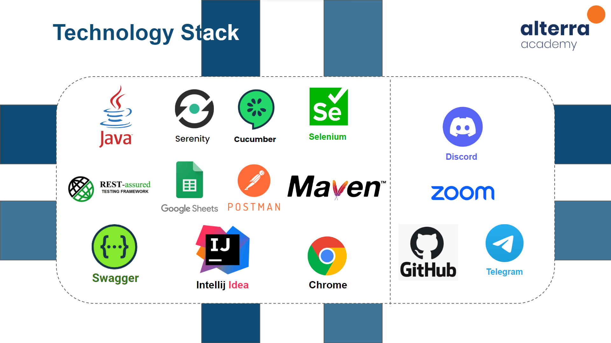
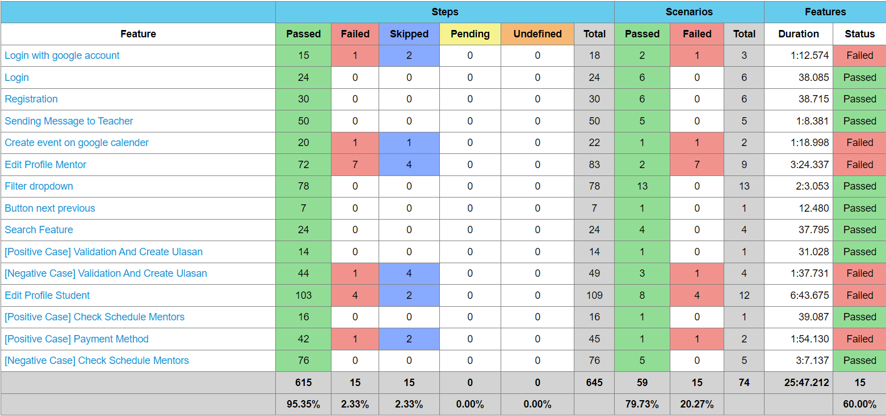
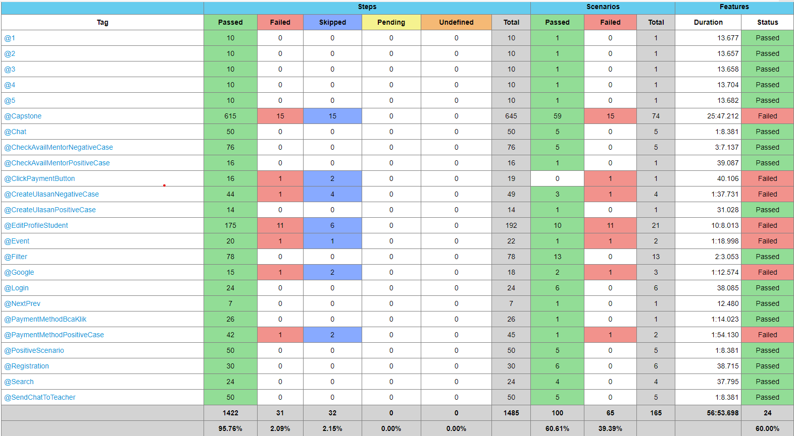

# MUSICLAB - QE - WEB

<div align="center">
  <a href="https://github.com/group3-musiclab/MusicLab-QE-WebTesting">
    
  </a>

  <p align="center">
    Capstone Program Immersive Alterra Academy
    <br />
    <a href="https://docs.google.com/spreadsheets/d/1SDZm54IAdbu0Abg80r6qpVvvbhJy8JSMoNu_9H--FRY/edit#gid=0"><strong>| Test Case Web Documentation |</strong></a>
    <br />
    <br />
  </p>
</div>

## 📑 About the Project

<p align="justify">MUSICLAB is an online web-app that used by user to find music teacher. There are many genres and instruments that will be available in this web-app. In this web-app User(Student) can book a music class depend on their choice and the Mentor can make their own music class after fill the credential. In order to make sure our app works well and following the requirements. We as a backend engineer build efficient and tested our systems.</p>

**Communication:**  


## 🛠 Technology Stack

<div align="center">
  
</div>

## ⚙️ SUMMARY REPORT

<div align="center">
  
</div>

## 📂 REPORT COVERAGE

<div align="center">
  
</div>

## 🛠️ How to Run Locally

- Clone it

```
$ git clone https://github.com/group3-musiclab/MusicLab-QE-WebTesting.git
```

- Go to directory

```
$ cd MusicLab-QE-WebTesting
```

- Run the project with the capstone being the main tag

```
$ mvn clean test
```

# 🤖 Author

- Aldan Maulana Fajri <br> [](https://github.com/RenPaijo)
- Aisyah Dewi Rulyadi <br> [](https://github.com/icaadr)
- Arif Ramadhan Setu <br> [](https://github.com/ariframadhan1702)
- Alan Darma Saputra <br> [](https://github.com/alandarma)
- Muhammad Bilal <br> [](https://github.com/bilalbilul)
- Rizki Kurniawan Rasyid <br> [](https://github.com/rizkura96)

<h5>
<p align="center">Built with ❤️ by MusicLab Team ©️ 2023</p>
</h5>
